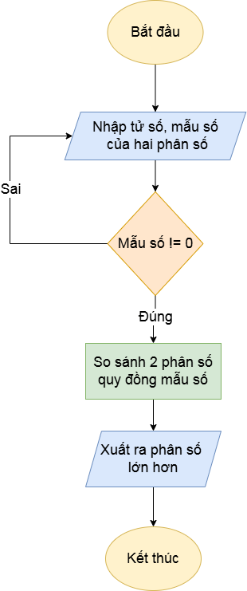

## Viết chương trình nhập vào hai phân số, tìm phân số lớn nhất và xuất ra kết quả
Nội dung flowchart:

## Mô tả đầu vào, đầu ra:
-	Đầu vào: tử số, mẫu số (mẫu số phải khác 0)
-	Đầu ra: Phân số đã rút gọn
## Tính năng của hàm:
-	Đầu tiên, nhập vào tử số và mẫu số của hai phân số (mẫu số khác 0)
-	Tiếp theo đặt một biến phụ để tính giá trị của phân số 1 trừ đi phân số 2 khi quy đồng mẫu số
-	Kế đến so sánh biến đó với 0, để kết luận phân số lớn hơn
-	Cuối cùng, xuất ra phân số lớn nhất

