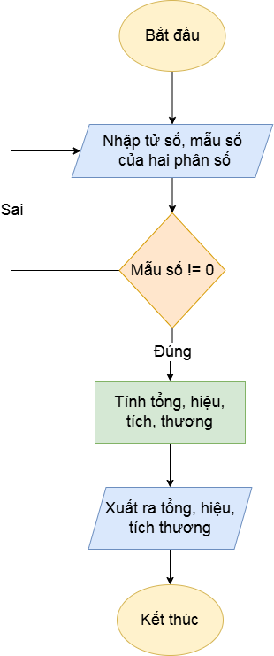

## Bài tập 3:  Viết chương trình nhập vào hai phân số. Tính tổng, hiệu, tích, thương và xuất ra kết quả
## Nội dung flowchart:

## Mô tả đầu vào, đầu ra:
-	Đầu vào: tử số, mẫu số của 2 phân số (mẫu số phải khác 0)
-	Đầu ra: Tổng, hiệu, tích, thương của 2 phân số

## Tính năng của hàm:
-	Đầu tiên, nhập vào tử số và mẫu số của hai phân số (mẫu số khác 0)
-	Rút gọn 2 phân số
-	Tiếp theo đặt 4 biến kiểu phân số tổng, hiệu, tích, thương để lưu giá trị của 4 phép tính
-	Kế đến, tính toán tử số và mẫu số của tổng, hiệu, tích, thương, và rút gọn phân số trước khi lưu vào 4 biến tổng, hiệu, tích, thương
-	Lưu ý, khi tử số của phân số thứ 2 là 0 thì thương không thể tính
-	Cuối cùng, xuất ra 4 biến tổng, hiệu, tích, thương
