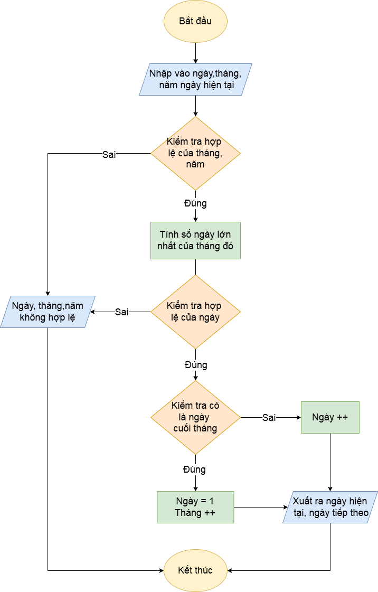

## Bài tập 4: Viết chương trình nhập vào một ngày. Tìm ngày kế tiếp và xuất kết quả
## Nội dung flowchart:

## Mô tả đầu vào, đầu ra:
-	Đầu vào: ngày, tháng, năm
-	Đầu ra:
+ Nếu ngày, tháng, năm không hợp lệ thì in ra không hợp lệ
+ Ngược lại, in ra ngày hiện tại, ngày tiếp theo
## Tính năng của hàm:
-	Đầu tiên, kiểm tra tính hợp lệ của năm, tháng
-	Nếu không hợp lệ thì in ra không hợp lệ và kết thúc chương trình
-	Nếu hợp lệ, tính số ngày lớn nhất của tháng kiểm tra tính hợp lệ của ngày
-	Nếu ngày không hợp lệ, in ra không hợp lệ và kết thúc chương trình
-	Ngược lại, kiểm tra có phải là ngày cuối tháng không
-	Nếu đúng thì qua tháng mới và ngày = 1;
-	Ngược lại, thì ngày tăng thêm 1;
-	Cuối cùng, xuất ra ngày hiện tại và ngày cuối cùng

